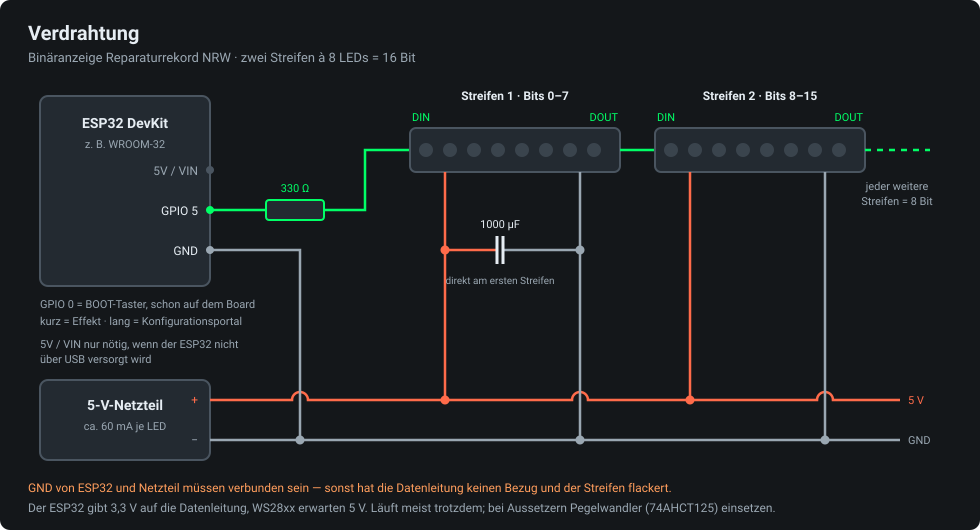

# binary-repair-wr-display

Binäranzeige für den **Reparaturrekord NRW**. Ein ESP32 holt den aktuellen Zählerstand
von [reparatur.fab-bergisch.org](https://reparatur.fab-bergisch.org/api-doku) und zeigt
ihn als Binärzahl auf WS28xx-LED-Streifen an.

Jede LED ist ein Bit. Zwei Streifen à 8 LEDs ergeben 16 Bit (bis 65.535), ein dritter
Streifen macht daraus 24 Bit. Die Anzahl wird im Webinterface eingestellt — LED-Streifen
können ihre Länge nicht selbst melden, Autoerkennung ist hardwareseitig nicht möglich.

Kein WLED, keine Cloud: ein einziger Arduino-Sketch mit FastLED.

## Was es kann

- **Captive Portal**: Ist kein WLAN konfiguriert oder keines erreichbar, öffnet der ESP32
  ein eigenes WLAN `Repair-Display`. Die Konfigurationsseite poppt auf Handy und Laptop
  von selbst auf. Bis zu drei Netze werden gespeichert und der Reihe nach durchprobiert —
  praktisch, wenn das Display zwischen Werkstatt und Veranstaltungsort wandert.
- **Taster ohne Löten**: Der BOOT-Taster auf GPIO 0 ist auf jedem DevKit schon da.
  Kurz drücken schaltet zum nächsten Effekt, lang drücken (2 s) öffnet das Portal —
  auch mitten im Betrieb, ohne IP und ohne Laptop.
- **Adaptive Länge**: 8, 16, 24, 32 … bis 64 LEDs, im Webinterface umstellbar, ohne neu
  zu flashen.
- **Zwei Anzeigearten**: Binärzahl oder Fortschrittsbalken zum Kampagnenziel.
- **Umschaltbarer Wert**: `total` (erfolgreiche Reparaturen), `attempted`, `today`
  oder `pending`.
- **Bit-Reihenfolge umstellbar**: erste LED = Bit 0 oder erste LED = höchstes Bit,
  je nachdem wie die Streifen hängen. Dreht auch den Balken um.
- **Fünf Effekte** für die eingeschalteten LEDs (siehe [Effekte](#effekte)), Farbe und
  Geschwindigkeit im Portal einstellbar.
- **Strombegrenzung**: Strombudget in mA eintragen, FastLED dimmt notfalls gleichmäßig
  herunter. Verhindert, dass eine volle weiße Kette das Netzteil in die Knie zwingt und
  der ESP32 mitten im Betrieb neu startet.
- **Kampagnenstatus**: Vor dem Start läuft ein ruhiges Wartemuster statt einer
  nichtssagenden 0, nach dem Ende bleibt der Endstand stehen und atmet langsam.
- **Ziel erreicht**: einmalige Feier-Animation, danach glimmen dauerhaft auch die Nullen
  in einer zweiten Farbe mit — dann leuchtet die ganze Kette, nicht nur die Einsen.
- **Start-Animation**: ein Lauflicht hin und zurück, zeigt nebenbei, dass jede LED lebt.
- **Rückmeldung ohne Bildschirm**: grüner Wisch, sobald das WLAN steht (auch nach einem
  Ausfall); pulsierende erste LED, solange das Konfigurationsportal offen ist.
- **Wert überlebt den Stromausfall**: der letzte Stand liegt im Flash und steht sofort
  wieder da. Im gleichen Speicherplatz landet auch ein von Hand eingetippter Wert.
- **Offline-Modus**: Wert im Portal eintragen, API wird gar nicht erst abgefragt —
  zum Vorführen und Testen ohne Internet.
- **Verschiedene Chips**: WS2812B, WS2811, WS2813, WS2815, SK6812 und die Farbreihenfolgen
  GRB/RGB/BRG sind alle einkompiliert und werden im Webinterface ausgewählt.
- **Testmuster und `/status.json`** für den Fall, dass vor Ort etwas klemmt und man nur
  ein Handy dabei hat.

Das Pulsieren der ersten LED funktioniert in beiden Bitzuständen: statt die Helligkeit zu
drehen — womit eine LED mit Bit = 0 schwarz bliebe — wird zur Markierungsfarbe hin
gemischt. Aus Schwarz wird so ein blaues Pulsieren, aus einer leuchtenden LED ein Hin und
Her der Farbe.

## Effekte

Alle Effekte gelten **nur für die eingeschalteten LEDs**. Verläufe verteilen sich über die
Einsen; die Nullen dazwischen werden übersprungen und zählen nicht mit. Die Nullen sind
standardmäßig ganz aus, damit die Kette wie ein durchgehendes Objekt wirkt und nicht wie
zwei aneinandergesteckte Streifen.

| Effekt | Verhalten |
|---|---|
| Solid | eine feste Farbe |
| Rainbow | Farbverlauf über die Einsen, wandert langsam durch |
| Neue Farbe bei jedem Update | eine Farbe, die bei jeder neuen Reparatur ein Stück weiterspringt |
| Atmen | eine Farbe, deren Helligkeit langsam auf- und abschwillt |
| Party | jede Eins eine eigene Farbe, harte Sprünge ohne Überblenden |

Geschwindigkeit 1–10. Solid und Atmen benutzen die eingestellte Farbe, die anderen drei
ihre eigenen. Kurzer Druck auf den BOOT-Taster schaltet zum nächsten Effekt.

## Hardware

| Teil | Hinweis |
|---|---|
| ESP32 Dev Board | z. B. ESP32-WROOM-32 DevKit |
| 2 × WS2812B-Streifen à 8 LEDs | in Reihe: DOUT des ersten → DIN des zweiten |
| 5-V-Netzteil | ca. 60 mA pro LED bei Weiß und Vollhelligkeit einplanen |
| Widerstand 330 Ω | in die Datenleitung, direkt am ESP32 |
| Elko 1000 µF | zwischen 5 V und GND am ersten Streifen |



**Gemeinsame Masse.** GND von ESP32 und Netzteil müssen verbunden sein. Ohne gemeinsamen
Bezug ist der Datenpegel undefiniert und der Streifen flackert oder zeigt Müll. Der ESP32
kann die LEDs nicht mitversorgen — 16 weiße LEDs ziehen fast ein Ampere.

**3,3 V gegen 5 V.** Der ESP32 gibt 3,3 V auf die Datenleitung, WS28xx erwarten nach
Datenblatt rund 0,7 × 5 V = 3,5 V für eine sichere Eins. In der Praxis läuft es meist
trotzdem, aber es ist der häufigste Grund für „funktioniert auf dem Tisch, zickt in der
Installation". Wenn es flackert, hilft eines davon:

- **Pegelwandler 74AHCT125** zwischen GPIO und DIN — die saubere Lösung, kostet ein paar
  Cent. Kein 74HCT*4*125 verwechseln, und kein bidirektionaler I²C-Wandler, der ist zu
  langsam.
- **Erste LED als Opfer-LED**: eine zusätzliche LED vor den eigentlichen Streifen setzen
  und im Portal nicht mitzählen. Sie hebt den Pegel für alle folgenden an.
- **Datenleitung kurz halten** und das 330-Ω-Glied direkt am ESP32 lassen.
- **WS2815 statt WS2812B**: die laufen mit 12 V und sind beim Eingangspegel gutmütiger.

Der Datenpin steht als `#define LED_PIN 5`, der Taster als `#define BUTTON_PIN 0` in
[config.h](binary-repair-display/config.h). Beide lassen sich nur durch Neuflashen ändern:
FastLED braucht den Pin zur Compile-Zeit.

## Software

Arduino IDE, Board-Paket **esp32** von Espressif, Board „ESP32 Dev Module".

Bibliotheken über den Bibliotheksverwalter:

- **FastLED** (Daniel Garcia)
- **ArduinoJson** (Benoit Blanchon) — Version 7

Dann den Ordner `binary-repair-display/` öffnen und flashen.

## Erste Inbetriebnahme

1. Flashen, LEDs anschließen, Strom dran.
2. Ein Punkt läuft einmal hin und zurück (Start-Animation). Danach pulsiert die erste LED
   blau → der ESP32 hat noch kein WLAN und das Konfigurationsportal ist offen.
3. Mit Handy oder Laptop ins WLAN **`Repair-Display`** (Passwort `reparieren`).
   Die Konfigurationsseite öffnet sich automatisch, sonst `http://192.168.4.1/` aufrufen.
4. WLAN auswählen, Passwort eintragen, Anzahl LEDs setzen, Strombudget des Netzteils
   eintragen, speichern.
5. Der ESP32 startet neu, wischt einmal grün durch und zeigt die Zahl an.
   Die IP steht im seriellen Monitor (115200 Baud); danach ist die Seite auch unter
   `http://repair-display.local/` erreichbar.

Stimmt die Leserichtung nicht, im Webinterface die Bit-Reihenfolge umschalten.
Sind Rot und Grün vertauscht, die Farbreihenfolge auf RGB oder BRG stellen.
Später kommt man jederzeit mit einem langen Druck auf den BOOT-Taster ins Portal zurück.

## Ablesen

Beispiel mit 16 LEDs, Standardeinstellung (erste LED = Bit 0):

```
LED:      0  1  2  3  4  5  6  7   8  9 10 11 12 13 14 15
Wert:     1  2  4  8 16 32 64 128  256 512 ...
Stand 30: ○  ●  ●  ●  ●  ○  ○  ○   ○  ○  ○  ○  ○  ○  ○  ○      2+4+8+16 = 30
```

## Was die Anzeige wann macht

| Situation | Anzeige |
|---|---|
| Einschalten | Lauflicht hin und zurück |
| WLAN wird gesucht | gelber Punkt läuft durch |
| WLAN verbunden | grüner Wisch von vorn nach hinten |
| Konfigurationsportal offen | Zahl bleibt ablesbar, die erste LED pulsiert blau |
| Kampagne läuft noch nicht | ruhiger Punkt zieht langsam hin und her |
| Kampagne beendet | Endstand bleibt stehen und atmet langsam |
| Ziel geknackt | einmal Regenbogen, danach glimmen auch die Nullen mit |
| API nicht erreichbar / 429 / 503 | letzter bekannter Wert bleibt stehen, alle 3 s kurz dunkel |
| Zahl passt nicht in die LEDs | alle gesetzten Bits leuchten rot |

Das entspricht der Empfehlung der API-Doku, bei 502/503 den letzten bekannten Stand zu
halten. Bleibt das WLAN länger als fünf Minuten weg, startet der ESP32 neu: dabei werden
wieder alle gespeicherten Netze durchprobiert, und falls keines geht, öffnet sich das
Konfigurationsportal — sonst käme man an ein Display mit falschem WLAN-Passwort nie
wieder heran.

## Dateien

| Datei | Inhalt |
|---|---|
| [binary-repair-display.ino](binary-repair-display/binary-repair-display.ino) | Setup und Hauptschleife |
| [config.h](binary-repair-display/config.h) | Einstellungen, Defaults, Speichern im Flash |
| [display.h](binary-repair-display/display.h) | LED-Ausgabe, Binärzahl, Balken, Effekte, Animationen |
| [api.h](binary-repair-display/api.h) | Abruf von `/api/stats` und `/api/campaign` |
| [portal.h](binary-repair-display/portal.h) | Webinterface, Captive Portal, `/status.json` |
| [button.h](binary-repair-display/button.h) | BOOT-Taster: Effekt wechseln, Portal öffnen |
